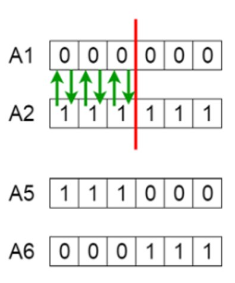

# Ejercicio Algoritmo Genético

Escriba un programa llamado **genetico.py**

Defina un método llamado mutacion que reciba dos parámetros

- Elemento de  población
- Probabilidad  de mutación

Debe de regresar una lista que representa al elemento recibido y después del proceso de mutación

------

Defina un método llamada **cruzamiento** que reciba *dos* elementos de la población (*listas*) y que regresara una lista con las dos nuevas listas (los elementos generados después del proceso de cruzamiento).

